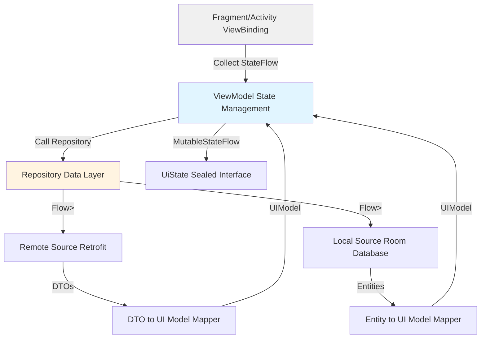

# Project Overview

Pion-Base is a modern Android application template that serves as a foundation for building Android apps with Clean Architecture principles. The project demonstrates a robust MVVM architecture with multi-module structure, featuring comprehensive support for internationalization (20+ languages), Firebase integration, and a flexible ads/IAP library module.

**Core Tech Stack:**
- **UI Layer:** XML layouts with ViewBinding and DataBinding (Jetpack Navigation for routing)
- **Asynchronous:** Kotlin Coroutines with Flow for reactive streams
- **Dependency Injection:** Hilt (Dagger Hilt) for compile-time DI
- **Networking:** Retrofit2 with OkHttp3 (Chucker for network debugging)
- **Local Storage:** Room Database + DataStore Preferences
- **Image Loading:** Glide
- **Firebase:** Analytics, Crashlytics, Remote Config
- **Logging:** Timber
- **Build System:** Gradle Version Catalog with Kotlin DSL

## Repository Structure

**Multi-Module Architecture:**
- `app/` - Main application module containing all business logic
- `LibAds/` - Shared library module for Ads (AdMob) and In-App Purchases (Billing)

**Package Naming Convention:**
- App module: `pion.tech.pionbase.*`
- LibAds module: `pion.datlt.libads.*`

**App Module Structure:**
```
pion.tech.pionbase/
├── app/                    # Application-level components
│   ├── MainActivity.kt
│   ├── MyApplication.kt
│   └── CommonViewModel.kt
├── base/                   # Base classes and shared components
│   ├── BaseFragment.kt
│   ├── BaseViewModel.kt
│   ├── BaseDialogFragment.kt
│   ├── BaseBottomSheetDialogFragment.kt
│   ├── BaseListAdapter.kt
│   ├── LoadingDialog.kt
│   ├── navigator/          # Navigation wrapper
│   └── firebaseAnalytics/  # Analytics abstraction
├── data/                   # Data layer
│   ├── database/           # Room database and DAOs
│   ├── model/              # DTOs, UI Models, Entities
│   ├── remote/             # Retrofit API interfaces
│   └── repository/         # Repository implementations
├── di/                     # Hilt dependency injection modules
├── feature/                # Feature modules (UI + ViewModels)
│   ├── home/
│   ├── language/
│   ├── onboard/
│   ├── setting/
│   └── splash/
└── util/                   # Utilities and extensions
```

## Architectural Blueprint

**Pattern:** MVVM (Model-View-ViewModel) with Clean Architecture principles

**UI Layer:**
- **State Management:** Uses `MutableStateFlow<T>` exposed as immutable `StateFlow<T>`
- **Custom UI State:** Sealed interface `UiState<T>` with states: `None`, `Loading`, `Success<T>`, `Error(Throwable)`
- **Fragment Lifecycle:** All fragments extend `BaseFragment<Binding, VM>` with ViewBinding
- **ViewBinding:** Enabled for type-safe view access; DataBinding for complex layouts
- **Observation:** ViewModels expose `StateFlow` collected in fragments using `lifecycleScope`
- **Loading State:** Centralized loading dialog management via `showHideLoading()`

**Domain Layer:**
- **Use Cases:** Not explicitly separated; business logic resides in ViewModels
- **Repository Pattern:** Each data source has corresponding interface + implementation
- **Error Handling:** Custom `Result<T>` sealed class (`Success<T>`, `Error<T>`) wraps all operations

**Data Layer:**
- **Single Source of Truth:** Room Database for persistent data; API as remote source
- **Repository Pattern:** Repositories orchestrate data from remote (Retrofit) and local (Room) sources
- **Mapper Pattern:** DTOs transformed to Domain/UI Models using extension functions (e.g., `.toPresentation()`)

## Feature & Screen Anatomy

**Standard Feature Structure:**
Each feature folder in `pion.tech.pionbase.feature.*` must contain:
- `{Feature}Fragment.kt` - Main UI implementation
- `{Feature}FragmentEx.kt` - Fragment extensions/helpers (optional)
- `{Feature}ViewModel.kt` - Business logic and state management
- `adapter/` - RecyclerView adapters if needed
- `dialog/` - Feature-specific dialogs (optional)
- `bottomSheet/` - Bottom sheet implementations (optional)

**ViewModel Pattern:**
```kotlin
@HiltViewModel
class FeatureViewModel @Inject constructor(
    private val repository: FeatureRepository,
) : BaseViewModel() {
    
    private val _uiState = MutableStateFlow(FeatureUiState())
    val uiState = _uiState.asStateFlow()
    
    // Data class for state
    data class FeatureUiState(
        val isLoading: Boolean = false,
        val data: List<ItemUIModel>? = null,
        val error: Throwable? = null,
    )
    
    // Use handleApiCall extension for boilerplate-free API calls
    fun loadData() {
        handleApiCall(
            apiCall = { repository.getData() },
            onSuccess = { data ->
                _uiState.value = _uiState.value.copy(
                    isLoading = false,
                    data = data,
                    error = null
                )
            },
            onError = { error ->
                _uiState.value = _uiState.value.copy(
                    isLoading = false,
                    error = error
                )
            }
        )
    }
}
```

**Dependency Injection:**
- Use `@HiltViewModel` annotation on all ViewModels
- Inject dependencies via constructor: `@Inject constructor(...)`
- Provide dependencies in `di/` modules with `@Module` and `@InstallIn`

**State Hoisting:**
- State flows from ViewModel → Fragment
- Use `copy()` for immutable state updates
- Collect `StateFlow` in `init {}` or specific lifecycle methods

## Data Management (Repository Pattern)

**Repository Implementation Pattern:**
```kotlin
class FeatureRepositoryImpl @Inject constructor(
    private val apiInterface: ApiInterface,
    private val appDatabase: AppDatabase,
) : FeatureRepository {
    
    override fun getData(): Flow<Result<List<ItemDtoModel>>> =
        flow<Result<List<ItemDtoModel>>> {
            emit(Result.Success(apiInterface.getData().dataResponse))
        }.catch {
            emit(Result.Error(it))
        }.flowOn(Dispatchers.IO)
}
```

**Data Layer Orchestration:**
- **Remote Data:** Retrofit2 with OkHttp3, wrapped in Flow<Result<T>>
- **Local Data:** Room database accessed via DAOs
- **Cache Strategy:** Repositories can implement cache-first or network-first strategies

**Mapper Pattern:**
```kotlin
// DTO (Network) Model
data class ItemDtoModel(
    val id: String,
    val name: String,
)

// UI/Presentation Model
data class ItemUIModel(
    val id: String,
    val name: String,
    val displayText: String,
)

// Extension function for transformation
fun ItemDtoModel.toPresentation(): ItemUIModel = ItemUIModel(
    id = id,
    name = name,
    displayText = "$name - $id"
)
```

**Error Handling Strategy:**
- All repository methods return `Flow<Result<T>>`
- `Result<T>` sealed class: `Success<T>` or `Error(Throwable>`
- Use `handleApiCall` extension in ViewModels to process results
- Network errors caught with `.catch { }` in repository Flow

## Build & Development Commands

```bash
# Clean and build
./gradlew clean

# Build debug APK
./gradlew assembleDebug

# Build release APK
./gradlew assembleRelease

# Run unit tests
./gradlew test

# Run instrumented tests
./gradlew connectedAndroidTest

# Lint checks (if configured)
./gradlew lint

# Build all modules
./gradlew build
```

## Kotlin Style & Conventions

**Naming Conventions:**
- **ViewModels:** `{Feature}ViewModel.kt` (e.g., `HomeViewModel.kt`)
- **Fragments:** `{Feature}Fragment.kt` (e.g., `HomeFragment.kt`)
- **UI Models:** `{Entity}UIModel.kt` (e.g., `InstalledAppUIModel.kt`)
- **DTOs:** `{Entity}DtoModel.kt` (e.g., `InstalledAppDtoModel.kt`)
- **Entities:** `{Entity}Entity.kt` (e.g., `DummyEntity.kt`)
- **Resource IDs:** `snake_case` (e.g., `ic_setting_language.xml`, `fragment_home.xml`)
- **Composables:** Not applicable (using XML layouts)

**Asynchrony Standards:**
- **ViewModel Scope:** Use `viewModelScope` (automatically cancelled on ViewModel clear)
- **Fragment Scope:** Use `lifecycleScope` (automatically cancelled on Fragment destroy)
- **Extension Functions:** Use provided extensions for coroutines:
  - `launchIO { }` - Dispatchers.IO for network/database operations
  - `launchDefault { }` - Dispatchers.Default for CPU-intensive work
  - `launchMain { }` - Dispatchers.Main for UI updates
- **Exception Handling:** All coroutine launch functions include `CoroutineExceptionHandler`

**Threading Rules:**
- **Inject Dispatchers:** For testability, inject `CoroutineDispatcher` instead of hardcoding
- **Flow Operations:** Use `.flowOn(Dispatchers.IO)` for upstream Flow operations
- **Main Thread:** Always update UI on `Dispatchers.Main`
- **Repository Operations:** Execute on `Dispatchers.IO` or injected dispatcher

## Navigation & Routing

**Navigation Method:** Jetpack Navigation Component with XML graphs

**Navigation File:** `app/src/main/res/navigation/nav_main.xml`

**Navigation Flow:**
```
SplashFragment (start) → LanguageFragment → OnboardFragment → HomeFragment → SettingFragment
     ↓                                          ↓
   HomeFragment (if language set)         HomeFragment (after onboard)
```

**Implementation Details:**
- Use `findNavController()` in fragments
- Navigate using action IDs: `findNavController().navigate(R.id.action_A_to_B)`
- Back stack management with `popUpTo` and `popUpToInclusive`
- Navigation wrapped in `Navigator` interface for abstraction

**Deep Links & Arguments:**
- Navigation arguments defined in XML using `<argument>` tags
- Deep linking not currently implemented
- > TODO: Add deep link support if needed

## Architecture Diagram



**Data Flow Explanation:**
1. **Fragment** observes `StateFlow<UiState<T>>` from ViewModel
2. **ViewModel** manages state and calls Repository methods
3. **Repository** orchestrates data from Remote (API) and Local (Database)
4. **API** returns DTOs wrapped in `Flow<Result<T>>`
5. **Mapper** transforms DTOs/Entities to UI Models
6. **ViewModel** updates `MutableStateFlow` with new state
7. **Fragment** recomposes/updates UI based on state changes

## Security & Agent Guardrails

**Secret Management:**
- **Environment Variables:** Store sensitive keys in `local.properties` (not committed to Git)
- **BuildConfig:** Use `BuildConfig` fields for runtime configuration
- **API Keys:** Never hardcode; reference via `local.properties` in `build.gradle.kts`
- **Firebase:** `google-services.json` is committed (acceptable for public projects)

**Files AI Agent MUST NOT Modify:**
- **Build Configuration:** `build.gradle.kts`, `settings.gradle.kts`, `gradle.properties`
- **Version Catalog:** `gradle/libs.versions.toml` (critical for dependency management)
- **AndroidManifest:** Core tags like `<application>`, permissions, intent-filters
- **ProGuard Rules:** `app/proguard-rules.pro` (unless adding new rules)
- **Firebase Config:** `google-services.json`, `app/google-services.json`
- **Base Classes:** `BaseFragment.kt`, `BaseViewModel.kt` (unless fixing bugs)
- **Navigation Graph:** `nav_main.xml` core structure (only add new destinations)
- **Database Schema:** Room entity definitions (use migration strategy for changes)

**Allowed Modifications:**
- Add new features following the standard feature structure
- Create new ViewModels, Fragments, and repositories
- Add new layout resources
- Implement new repository methods and data mappers
- Create extension functions in `util/` package
- Add navigation actions and destinations (following existing patterns)

**Guardrails for Code Generation:**
- Always use `Result<T>` wrapper for repository operations
- Never block the main thread; use coroutines for async operations
- Follow the `handleApiCall` pattern for API calls in ViewModels
- Use `@HiltViewModel` for all ViewModels
- Ensure all state is immutable; use `copy()` for updates
- Transform DTOs to UI Models before exposing to ViewModels
- Never expose `MutableStateFlow` publicly; use `asStateFlow()`
- Always inject dependencies; avoid manual instantiation

> TODO: Add unit test examples and guidelines
> TODO: Document the LibAds module integration pattern
> TODO: Add guidelines for handling permission requests
> TODO: Document the Firebase Remote Config usage pattern
